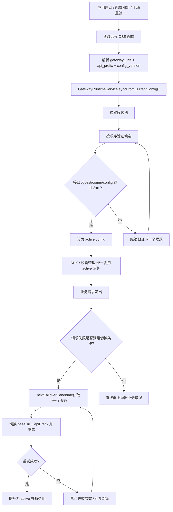
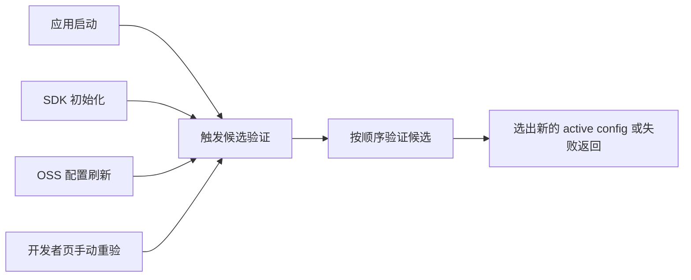
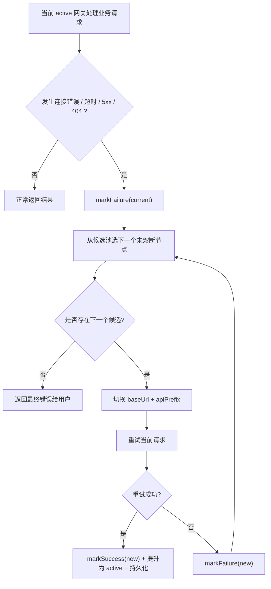

# 网关与主业务 API 故障自动切换说明

本文说明当前客户端中“设备管理网关”和“主业务 API”从 **远程获取**、到 **候选构建**、到 **验证判断**、再到 **故障自动切换**、最后到 **用户端表现** 的完整链路。

目标：

- 说明 `gateway_urls` 和 `api_prefix` 如何进入客户端
- 说明候选节点如何生成、验证、熔断、恢复
- 说明主业务请求为什么会切换、何时不会切换
- 说明设备管理与主业务之间的关系
- 方便排障、交接、后续继续优化

---

## 1. 总体结论

当前客户端已经把“设备管理网关”和“主业务 API”的地址治理统一到了同一条运行时链路上：

1. 远程 OSS 下发 `gateway_urls` 和 `api_prefix`
2. 客户端将其构造成统一候选池
3. 通过接口路径 `/guest/comm/config` 验证候选是否可用
4. 选出当前 `active` 网关
5. 主业务请求和设备管理请求优先都走这个 `active` 网关
6. 请求失败时按候选池自动切换
7. 连续失败的节点会被熔断，冷却后恢复候选资格

因此，这不再是“页面各自找地址”，而是一套统一的运行时网关选择和切换机制。

---

## 2. 核心文件

- `lib/xboard/config/gateway_config.dart`
  统一网关候选、验证、熔断、回退、事件流

- `lib/xboard/adapter/initialization/sdk_provider.dart`
  SDK 初始化时绑定运行时网关配置，并在配置变化时热切换

- `lib/sdk/flutter_xboard_sdk/lib/src/core/http/http_service.dart`
  普通业务请求的自动故障切换执行位置

- `lib/xboard/features/initialization/providers/initialization_provider.dart`
  启动阶段的配置加载、缓存恢复、候选探测

- `lib/xboard/features/mine/pages/device_page.dart`
  设备管理页如何复用运行时网关

- `lib/views/developer.dart`
  网关诊断页面，展示候选、状态、事件、熔断信息

---

## 3. 地址从哪里来

### 3.1 远程来源

远程 OSS 配置会下发：

- `gateway_urls`
- `gateway_url`
- `api_prefix`
- `config_version`

它们会先进入 `XBoardConfigAccessor`，再被 `GatewayRuntimeService` 同步进候选池。

### 3.2 本地和兜底来源

除了远程 OSS，还会从以下来源补充候选：

1. 编译期 `XBOARD_GATEWAY_URL`
2. 上次成功缓存的网关 URL
3. 持久化的运行时 `active config`
4. 硬编码兜底 `productionGatewayUrl`

### 3.3 候选顺序

候选池重建时的大致顺序是：

1. `dart-define` 强制覆盖
2. 当前 `active config`
3. 内存缓存 `_cachedGatewayUrl`
4. OSS `gateway_urls/gateway_url`
5. 硬编码兜底

同一个 `baseUrl` 只保留一份，按 `baseUrl` 去重。

---

## 4. 总流程图



---

## 5. 候选池如何构建

候选池构建发生在 `GatewayRuntimeService.syncFromCurrentConfig()`。

### 5.1 构建规则

每个候选节点包含：

- `baseUrl`
- `apiPrefix`
- `source`
- `versionTag`
- `lastVerifiedAt`
- `lastFailureAt`
- `failureCount`
- `disabledUntil`

也就是说，候选池不仅存地址，还保存健康度和历史状态。

### 5.2 不会立即剔除失败节点

失败节点通常不会被立刻删除，而是保留在候选池中，等待：

- 后续重新验证
- 冷却期后恢复
- 新配置覆盖

所以候选池更像“地址知识库”，不是“当前仅存活节点列表”。

---

## 6. 候选验证条件

候选验证由 `_verifyCandidate()` 完成。

验证请求：

```text
{baseUrl}{apiPrefix}/guest/comm/config
```

### 6.1 验证成功条件

必须同时满足：

- 网络可连通
- 未超时
- TLS/DNS/连接正常
- 返回 HTTP `2xx`

### 6.2 验证失败条件

以下都算失败：

- `404`
- `401`
- `403`
- `5xx`
- 连接超时
- DNS 失败
- TLS 失败
- 连接错误

### 6.3 为什么现在用接口路径而不是根路径

因为“网站首页能打开”不代表“业务接口存在”。  
例如：

- 根路径 `200`
- 但 `/api/v1/guest/comm/config` 返回 `404`

这种情况对用户来说就是不可用网关，不能继续被选为 `active`。

---

## 7. 哪些事件会触发候选验证

会触发 `verifyAndActivateBestCandidate()` 的场景有：

1. 应用初始化
2. SDK 初始化
3. 远程配置变化
4. 开发者页手动点击“强制重新验证候选”

### 7.1 触发流程图



---

## 8. 主业务 API 如何发请求

主业务 API 通过 `HttpService` 发请求，底层实际使用：

- 当前 `active` 的 `baseUrl`
- 当前 `active` 的 `apiPrefix`

也就是说，请求路径不是写死的，而是运行时拼出来的：

```text
{active.baseUrl}{active.apiPrefix}{业务路径}
```

例如：

```text
https://d2.fastcat2.com/api/v1/passport/auth/login
```

---

## 9. 普通业务请求何时触发自动切换

当前 `HttpService` 中，普通业务请求在以下情况会触发 failover：

1. 连接错误
2. 连接超时
3. 发送超时
4. 接收超时
5. HTTP `5xx`
6. HTTP `404`

### 9.1 为什么把 `404` 纳入切换

因为在当前网关架构里，`404` 往往表示：

- 当前域名根站点还活着
- 但目标业务接口不存在
- 对用户来说等价于“这个网关不可用”

因此现在普通业务请求的切换条件，已经与网关诊断的可用性语义基本一致。

### 9.2 不会自动切换的典型情况

以下错误通常不会触发故障切换：

- `401`
- `403`
- 业务层明确拒绝但 HTTP 本身不是网关不可用

因为这些更像：

- token 失效
- 权限问题
- 业务状态问题

而不是“换一个网关就能恢复”的问题。

---

## 10. 普通业务请求故障切换执行过程

当一个业务请求命中切换条件时：

1. 记录当前节点失败
2. 从候选池选下一个未尝试、未熔断的节点
3. 同时切换 `baseUrl + apiPrefix`
4. 用新节点重试当前请求
5. 如果成功，则提升为新的 `active`
6. 如果失败，则继续尝试下一个候选

### 10.1 故障切换流程图



---

## 11. 设备管理如何复用同一条链路

设备管理页不再自己单独维护一套域名逻辑，而是：

1. 优先复用 SDK 当前 `httpService`
2. 复用运行时网关候选池
3. 在必要时按统一网关候选顺序兜底重试

因此它和主业务 API 的关系是：

- **地址来源一致**
- **候选池一致**
- **切换方向一致**

区别只是：

- 主业务 API 更依赖 SDK 内部 `HttpService`
- 设备管理页在页面层保留了额外兜底重试

---

## 12. 熔断机制

### 12.1 进入熔断

候选节点连续失败达到阈值后，会被熔断。

当前参数：

- 失败阈值：`2`
- 熔断时长：`90 秒`

### 12.2 `disabledUntil` 的意义

`disabledUntil` 表示：

> 在这个时间点之前，该候选节点暂时禁止参与故障切换选择。

它不是永久删除，而是“冷却截止时间”。

### 12.3 熔断期间的行为

熔断中的节点：

- 仍留在候选池中
- 诊断页显示为 `熔断中`
- `nextFailoverCandidate()` 会跳过它

### 12.4 熔断释放条件

以下任一情况都可恢复：

1. 当前时间超过 `disabledUntil`
2. 手动点击“清空熔断状态并重试”
3. 该节点后续请求成功并被 `markSuccess()`

---

## 13. 诊断页状态含义

当前诊断页中，候选节点状态分为四类：

- `已验证可用`
  说明最近一次验证成功，且没有更新的失败覆盖

- `未验证`
  说明只是进入了候选池，但还没有明确验证成功或失败记录

- `验证失败`
  说明最近一次验证或请求失败，且失败时间晚于最近成功验证时间

- `熔断中`
  说明失败次数达到阈值，正在冷却期内

这四类状态比单一“可用/不可用”更接近真实运行状态。

---

## 14. 为什么会出现“候选里有节点，但重新验证提示没有可用网关”

因为：

- 候选池表示“我知道这些地址”
- 验证成功表示“这些地址当前接口路径确实可用”

所以一个节点可能：

- 已进入候选池
- 没有被熔断
- 但它的 `/guest/comm/config` 返回 `404`

此时它会出现在候选列表中，但重新验证会失败，最终出现：

> 没有找到可用网关

这不是矛盾，而是“候选资格”和“真实可用性”是两层不同概念。

---

## 15. 用户端最终会看到什么

### 15.1 正常情况

用户无感知：

- 启动时自动选到可用网关
- 主业务接口正常返回
- 设备管理接口正常返回

### 15.2 某个节点坏掉

如果当前节点满足自动切换条件：

- 请求可能有一次短暂重试
- 随后自动切到下一个可用节点
- 用户通常无感或只感知到一次轻微延迟

### 15.3 所有候选都不可用

用户会看到：

- 登录 `404` / `5xx`
- 接口请求失败
- 开发者页显示“所有网关候选验证失败”

这时通常要排查：

1. OSS 中 `gateway_urls` 是否正确
2. `api_prefix` 是否匹配服务端
3. 本地缓存是否残留坏节点
4. 当前打包版本是否拿到了最新 OSS

---

## 16. 排障建议

### 16.1 登录前就 `404`

优先检查：

1. OSS 的 `gateway_urls` 第一项是否就是坏节点
2. 诊断页候选池里是否根本没有正确节点
3. 当前请求是否命中了 `404` 自动切换逻辑
4. 本地是否残留旧的 `active` 缓存

### 16.2 诊断页有节点但不切换

优先检查：

1. 该错误是否属于切换触发条件
2. 候选节点是否被熔断
3. 候选是否其实未验证或验证失败
4. 是否所有剩余候选都已尝试过

### 16.3 OSS 明明有地址但候选池没有

优先检查：

1. 客户端是否真的加载到了这份 OSS
2. `gateway_urls` 是否被成功解析到 `XBoardConfig.gatewayUrls`
3. 是否仍在使用旧缓存或旧配置源

---

## 17. 当前方案评价

### 17.1 优点

- 主业务 API 和设备管理统一到同一套网关运行时模型
- `gateway_urls + api_prefix` 可热更新
- 请求失败时可自动切换
- 熔断机制能避免反复命中坏节点
- 诊断页可观察性较好，适合排障

### 17.2 当前边界

- 候选池本身不是“已验证健康列表”，而是“地址候选集合”
- 登录前是否能切到正确节点，仍强依赖 OSS 中 `gateway_urls` 的正确性
- 如果所有候选本身都错，客户端无法自救

### 17.3 后续可继续优化的方向

1. 把“验证失败”做成显式字段，而不是基于时间推断
2. 为不同接口类型定义更细的 failover 策略
3. 让诊断页直接展示“最近一次验证 HTTP 状态码”
4. 给用户态日志增加“本次请求命中哪个网关”的可视化信息

---

## 18. 一句话总结

当前这套机制的核心是：

> 先从 OSS 和缓存构建统一候选池，再用接口路径验证选出 active 网关，业务请求失败时基于同一候选池自动切换，并用熔断避免反复命中坏节点。

这就是“从获取到更换判断再到用户端表现”的完整闭环。
